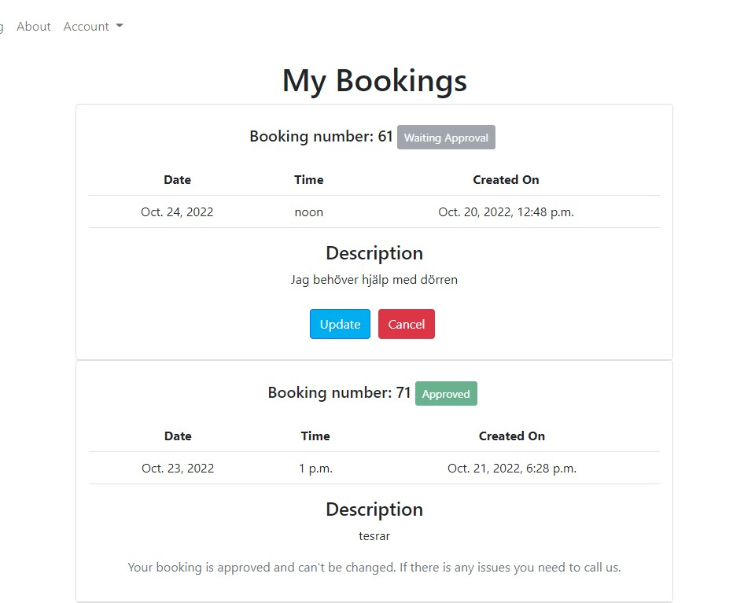
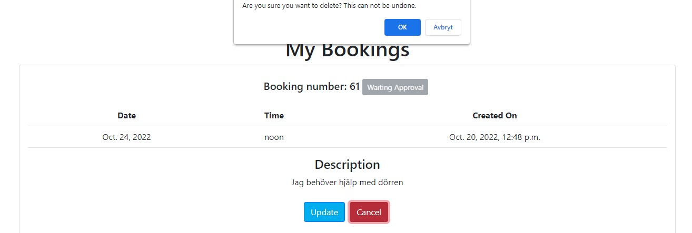

# Locksmith Booking
This is a booking application for a locksmith. When you have problems with your door or lock you can book a visit. 
The locksmith will then confirm your booking or call to get additional details.

Welcome to [Locksmith Booking](https://locksmith-booking.herokuapp.com/)!

## Contents
- [User Experience](#user-experience)
    - [User Stories](#user-stories)
    - [Agile Methodology](#agile-methodology)
    - [Wireframes/Flowchart](#wireframesflowchart)
    - [Design](#design)
- [Features](#features)
    - [Existing Features](#existing-features) 
    - [Future Features](#future-features)
- [Tecnologies Used](#technologies-used)
    - [Main Language](#main-language)
    - [Other Frameworks, Libraries and Software Used](#other-frameworks-libraries-and-software-used)
- [Testing](#testing)
    - [Manual Testing](#manual-testing)
    - [Input Validation](#input-validation)
    - [Validator Testing](#validator-testing)
    - [Lighthouse](#lighthouse)
- [Bugs](#bugs)
    - [Solved](#solved)
    - [Left to Solve](#left-to-solve)
- [Deployment](#deployment)
    - [To Deploy The Project](#to-deploy-the-project)
    - [Forking The Repository On GitHub](#forking-the-repository-on-github)
    - [How To Clone The Project](#how-to-clone-the-project)
- [Credits](#credits)
- [Acknowledgements](#acknowledgements)

## User Experience
### User Stories
#### Site User
- As a user I can want the ability to request a callback before the visit so that I can give more information and receive information.
- As a user I can have a confirmation so that I know the booking worked.
- As a user I can cancel my booking if I don't need it anymore.
- As a user I can edit my booking so that I can change time or give more information.
- As a user I can create an account so that I can see my bookings.
- As a user I can describe my problem so that I can get the help needed.
- As a user I can leave comments so that the locksmith knows how to access the problem.
- As a user I can see what i typed in so that I can check that I typed everything correctly before it's confirmed.
- As a user I can see the schedule of available times so that i can choose what fits me.
#### Staff Memmber
- As a admin I can see what information is given by the user so that I can prepare the work.
- As a admin I can see what times have been booked so that I can plan my work.
- As a admin I can see contact details about the user who bookes so that I can contact the user if needed.
- As a admin I can see the ID for the booking so that I have have a connection for invoicing.
- As a admin I can see the address so that I now where to go.
- As a admin I can move an appointment so that I can keep my schedule.
- As a admin I can mark a booking as finished so that I know what's left to do.

### Agile Methodology
#### GitHub Project Board
I this project I used GitHubs project board to keep track of my user stories. This was helpful for a bigger project like this so i could break down every user story to smaller pieces,
and keep track of what is left. It was also helpful for morale. It feels good to move the stories across the board, especially when you feel a little stuck. Using the labels helped to decide where to start each day.
This project is done by my self alone, but I understand that this tool would be even more important when there is more devolopers working on the same project.

[Back to top](#contents)
### Wireframes/Flowchart
Before I started the project I did some wireframes to give me some visuals of what I wanted. This was of big help when I started developing. The wireframes and the live version differs some, and there is some more features
in the live version that came up along the way. It takes some time to do these. But it will save alot of time in the devloping process if you have a picture of how you want it to look in the end.

### Design
#### Typography
For this project I decided to go with the standard bootstrap fonts. As Best Lås is a security company I wanted a clean and serious look. I thought the fonts provided by bootsrap were a good fit.

#### Colors
Here I also wanted a clean look. The logo for Best Lås have a lighter blue and black. I changed the bootstrap primary color to the same blue used in the logo. White is the background on all pages.

Edit: When testing the contrast it showed that the blue i had choosen was to light and was not enough contrast to the text. So I decided to go back to bootstraps original primary color to pass the tests.

[Back to top](#contents)
## Features
### Existing Features For All Users
#### Navigation Bar
The navigation bar is important for the user when visting the website. I wanted it to be clean, simple and easy to navigate.
I choosed to have all account related links in i dropdown, which will change depending if you are logged in as a staff member or a regular user. Or not logged in at all.
In the top right corner it will show if you are logged in and what username you have. When visiting the site on smaller screen sizes (below 992px) the navbar will be collapsable instead so it won't take up to much space on the screen.
Bootstrap was of big help when building the navbar.

The navbar when viewed on screens over 992px.

  

The navbar on a phone with menu expanded. To the right: The navbar on a phone with meny collapsed.

[Back to top](#contents)
#### Home
The first page you see when visiting the site is important for a good first impression. Here I choosed to have a heading with the company name, and a shorter text below. Followed by two call to action buttons.
Either to place a booking or to visit the About page to read more about the company. Below there is a dicrete image of a key in a marking machine.

I also decided to have reviews from previous customers showing on the start page. The staff members can choose which reviews to show and which ones to hide.
It is important to show some reviews to build trust towards new customers.

  

[Back to top](#contents)
#### About
I decied to create an about page so the users can read more about the company. This is important for building trust. As a user I want to know the company I am buying products/services from.
There is also photos of all the locksmiths that works at Best Lås so the user will get a face of the people that will visit them.

[Back to top](#contents)
#### Footer
As of the rest of the site, I wanted a clean and simple look here. Showing to the left is the company name and copyright information.
In the middle there is a small logo, and to the right there is some contact information and open hours. The footer is from bootstrap with some small adjustments to it.

[Back to top](#contents)
#### Login Page
The login page is from the authentication module allauth. I imported the template and gave it some basic styling using bootstrap. I also extended my base template so the user stays on the page when logging in and changed the text.

[Back to top](#contents)
#### Sign Up Page
The login page is also from the authentication module allauth. I imported the template and gave it some basic styling using bootstrap. I also extended my base template so the user stays on the page when logging in.

[Back to top](#contents)
#### Place Booking
- The place booking page is only accessible when logged in. If you are not logged in you will get redirected to the login page instead.
- The form contains all the necessary fields. Contact information, address and a description of the problem. The user can also choose a preffered time and date.
- The datepicker is the standard HTML element for picking dates. In the model I have used a function to validate that the booking can't be done on date in the past. In the form itself there is also a validation that disables dates that are closer than two days in the future. There is also a limit that you can't book more than 30 days in advance.
- For the phonenumber field i used [Django Phonenumber Field](https://pypi.org/project/django-phonenumber-field/) to validate the phonenumber.

- For the timepicker I used a plugin called [jQuery Timepicker](https://timepicker.co/). I used that plugin because i wanted times with 30 minutes interval, and I only wanted times in open hours to show. I didn't manage to get that to work with the standard HTML timepicker. After some research it seems that the support for that in the browsers are poor. So then the [jQuery Timepicker](https://timepicker.co/) was a better choice.

[Back to top](#contents)
#### Give Review
- The form for giving a review is only accessible when logged in as a regular user.
- It conatins only one textfield where the user can write his review.
- The user gets notified when submitting that the review is sent successfully and is waiting for approval. The reviews are showing on the index page, so I wanted it to be checked by a staff member before it's viewed there.

- I had problem with this form, and i gave a error 500 if you tried to submit only spaces. So I validated it by throwing a message if the input was invalid, and redirected back to the form again.

[Back to top](#contents)
#### My Bookings
- A page where the user can view his booking, edit it or cancel it. 
- When the booking is approved by a staff member the user can no longer edit or cancel it by themselves, and you have to call to make changes. The reason for this is to avoid last minute cancellations. The lockstmith maybe alredy planned the day and be on their way for the visit. 
- There is a label besides the booking number that shows if the booking is approved by a staff member or is pending.

- When user press update the form is showed again with the current inforamtion in it.

- When a user tries to cancel/delete a booking, an alert is shown and the user needs to confirm the cancellation.

[Back to top](#contents)
#### Custom 404 Page
- A custom 404 page that appears when trying to access a page that does not exist.
- Has the navbar present so you can easily return to an existing page.

[Back to top](#contents)
### Existing Features For Staff Memebers
#### All Bookings
- As a staff member you can view, edit and delete all bookings. The staff member also have the option to confirm a booking, or withdraw the confiramtion. If a change is made, or if it is deleted, the user who placed the booking will get an email notification about this.
- Staff members can do this because if they after talking to the customer got more information that is needed, or if they agreed on a different time, the customer himself don't need to update the booking.

- When a change is successful, a message will show. And an email will be sent to the customer.

- The same alert will show for the staff members as for the users when try to delete a booking.

[Back to top](#contents)
#### All Users
- Staff members can view, delete and assign/remove staff status from users.
- A label is showing to the right of the username if the the user has staff status.

[Back to top](#contents)
#### All Reviews
- As a staff member you can see all reviews.
- You can delete a review, but not edit it. The review should be a quotation of the customers own word and should not be altered.
- Staff member can choose if a review should be visible on the index page or not.
- When trying to delete a review an alert is showing and you need to confirm that you want to delete it permanently.

[Back to top](#contents)
### Future Features
- A connection to all the locksmiths schedules would be nice to have. So you can see immediately what times and which lockstmiths that are available. They could be booked on bigger projects and through other channels, so at the moment it was too big of a task to achieve.
- Archive bookings that finished is a feature i would like to add in the future. 
- Search fields in dashboard for staff members. So it will be easier to find the booking, user or review you are looking for.

[Back to top](#contents)
## Technologies Used
- [Django](https://www.djangoproject.com/) - A model-view-template framework used to create Locksmith Booking
- [Bootstrap](https://getbootstrap.com/) - A CSS framework used for the front end development.
- [HTML5](https://en.wikipedia.org/wiki/HTML) - Provides the content and structure for the website.
- [CSS3](https://en.wikipedia.org/wiki/CSS) - Provides the styling for the website.
- [JavaScript](https://en.wikipedia.org/wiki/JavaScript) - Provides interactive elements of the website
- [Python](https://en.wikipedia.org/wiki/Python_(programming_language)) - Provides the functionality of the website.
- [a11y](https://color.a11y.com/Contrast/) - Used to test the contrast and accessibility.
- [Gitpod](https://gitpod.io/) - Used to create and edit the website.
- [GitHub](https://github.com/) - Used to host the repository.
- [GitBash](https://en.wikipedia.org/wiki/Bash_(Unix_shell)) - Terminal used to push changes to the GitHub repository.
- [Google Chrome DevTools](https://developer.chrome.com/docs/devtools/) - Used to test responsiveness and debug.
- [Balsamiq](https://balsamiq.com/) - Used to create the wireframes for the project.
- [Cloudinary](https://cloudinary.com/) - Used to host all static files and images.
- [Heroku](https://dashboard.heroku.com) - Used to deploy the website
- [PEP8 Validation](http://pep8online.com/) - Used to validate Python code
- [HTML Validation](https://validator.w3.org/) - Used to validate HTML code
- [CSS Validation](https://jigsaw.w3.org/css-validator/) - Used to validate CSS code
- [JSHint Validation](https://jshint.com/) - Used to validate JavaScript code
- [Graph Models](https://django-extensions.readthedocs.io/en/latest/graph_models.html) - Used to generate a .dot file for all apps and models
- [dreampuf](https://dreampuf.github.io/GraphvizOnline/) - Used to present the .dot file in the form of a database diagram

[Back to top](#contents)
### Libraries
The following libraries are used in the project and are located in the requirements.txt file.

- asgiref==3.5.2
- cloudinary==1.30.0
- dj-database-url==0.5.0
- dj3-cloudinary-storage==0.0.6
- Django==3.2.15
- django-allauth==0.51.0
- django-crispy-forms==1.14.0
- django-phonenumber-field==7.0.0
- gunicorn==20.1.0
- oauthlib==3.2.1
- phonenumberslite==8.12.57
- psycopg2==2.9.3
- PyJWT==2.5.0
- python3-openid==3.2.0
- pytz==2022.4
- requests-oauthlib==1.3.1
- sqlparse==0.4.3
- types-cryptography==3.3.23

[Back to top](#contents)
## Testing
### Validator Testing
Locksmith Booking have been tested by using validation tools for HTML, CSS, JavaScript and Python.
- [W3C HTML Validator](https://validator.w3.org/)
- [W3C CSS Validator](https://jigsaw.w3.org/css-validator/)
- [JSHint JavaScript Validator](https://jshint.com/)
- [PEP8 Online Validator](http://pep8online.com/)

#### HTML Validation

#### CSS Validation

#### JavaScript Validation

#### Python Validation
The recommended tool for this is [PEP8 Online Validator](http://pep8online.com/) but when this was created the site was not available.
Workaround is to use pycodestyle directly in Gitpod instead.

### Manual testing

[Back to top](#contents)
## Bugs
### Solved

[Back to top](#contents)
### Left to Solve

[Back to top](#contents)
## Deployment
### To deploy the project
This application is deployed using [Heroku](https://heroku.com/).

The steps for deploying through [Heroku](https://heroku.com/) is as follows:

1. Visit [Heroku](https://heroku.com/) and make sure you are logged in.
2. Click on New and then choose New App.

3. Choose a name for your app and then choose your region.
4. Then press 'Create app'.

5. Make sure you are on the 'Deploy' tab.
6. Choose connect to GitHub account.
7. Search for your repository that you want to deploy.
8. Press 'Connect'

9. Choose if you want automatic deploys from your repository on GitHub.
10. Choose which branch you want to deploy.
11. Press 'Deploy Branch'.

12. When the installation is done. Go to the settings tab.
13. Press on 'Reveal Config Vars'.

14. Add config vars that are necessary. In this project it was the one showed below.

15. Add the buildpacks needed.

16. Now you are done and can open the app!

[Back to top](#contents)
### Forking the repository on GitHub
A copy of the repository can be made. This copy can be viewed and changed on another account without affecting the original repository.

The steps for doing this:
1. Make sure you are logged in on GitHub and then find the repository.
2. On the top right there is a button called Fork.
3. Press the Fork button to make a copy to your account.

[Back to top](#contents)
### How to clone the project
This is how you make a clone of the repository:

1. Click on the code tab under the repository name.
2. Then click on "Code" button to the right above the files listed.
3. Click on the clipboard icon to copy the URL.

4. Open Git Bash in the IDE of your choice.
5. Change the working directory to where you want your cloned directory.
6. Type `git clone` and then paste the URL that you copied.
7. Press enter and clone has been finished.

[Back to top](#contents)
## Credits

[Back to top](#contents)
## Acknowledgements

[Back to top](#contents)